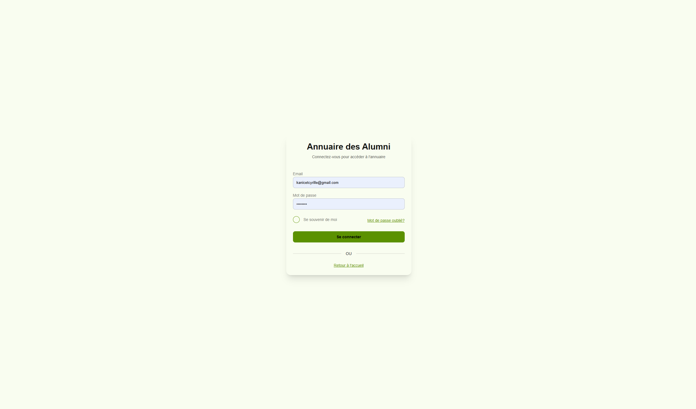
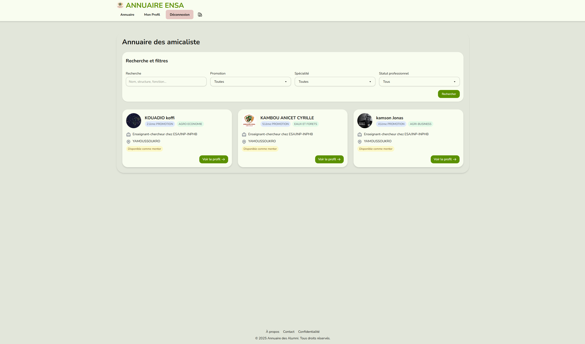
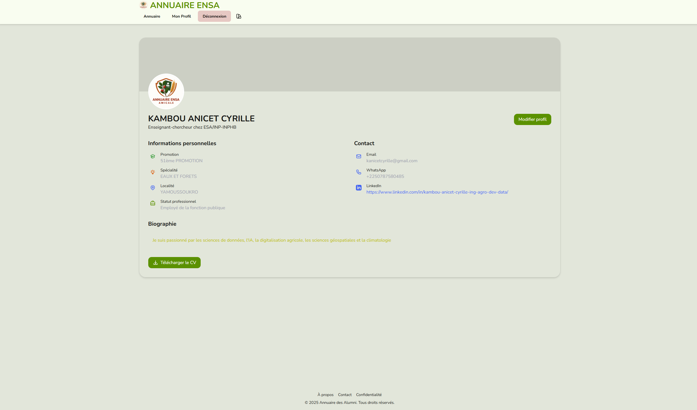

🥳 New UPDATE
Une proposition de logo pour l'App


# Configuration

## Cloné le dépot

```bash
git clone https://github.com/Mr-KAM/annuaire-ensa.git
cd annuaire-ensa
# Si vous n'avez pas déjà pew sinon utiliser virtualenv si vous êtes pls à la aise avec.
pip install pew
```

Si vous aviez dejà le depot cloné sur votre machine , mettez le à jour via `git pull`.

## Environnement virtuel

```bash
# Création d'un nouvel environnement virtuel

pew new annuaire

# Activation de l'environnement virtuel
pew workon annuaire

# Installation des dépendances
pip install -r requirements.txt
```

## Test

```bash
# Lancement de l'application
python app.py
```

## Docker

### Développement local avec Docker

Vous pouvez utiliser Docker pour exécuter l'application en local:

```bash
# Construire l'image Docker
docker build -t annuaire-ensa .

# Lancer le conteneur en local
docker run -p 5000:5000 \
  -e PUSHBULLET_KEY="votre_clé_pushbullet" \
  -e EMAIL_MESSAGERIE="votre_email" \
  -e EMAIL_MESSAGERIE_PASSWORD="votre_mot_de_passe" \
  -v ./instance:/app/instance \
  annuaire-ensa
```

Accédez à l'application à l'adresse http://localhost:5000

### Déploiement Cloud

Pour un déploiement cloud (par exemple sur Back4App, Heroku, etc.):

1. Poussez votre code sur GitHub:
   ```bash
   git add .
   git commit -m "Ajout configuration Docker"
   git push
   ```

2. Dans la plateforme de déploiement:
   - Configurez les variables d'environnement requises:
     - `PUSHBULLET_KEY`
     - `EMAIL_MESSAGERIE`
     - `EMAIL_MESSAGERIE_PASSWORD`
   - Assurez-vous que le port 5000 est exposé et accessible

3. Pour les plateformes basées sur Docker, le Dockerfile fourni sera utilisé automatiquement.

### Notes importantes

- Un volume Docker est utilisé pour le dossier `instance` afin de persister la base de données SQLite.
- Le script d'entrée `docker-entrypoint.sh` assure une initialisation correcte de la base de données.
- Si vous rencontrez des erreurs liées à l'encodage des fichiers, vérifiez que vos fichiers `.py` et `requirements.txt` sont bien encodés en UTF-8 sans BOM.

creer un fichier
`.env`

Puis ajoutter les variables d'environnment pour l'envoi de EMAIL et de sms avec pushbullet


```bash
PUSHBULLET_KEY=xxxxxxxxxxxxxxxxxxxxxxxxxxxxxxxxxxxxx
EMAIL_MESSAGERIE=monadressemail@gmail.com
EMAIL_MESSAGERIE_PASSWORD=xxxxxxxxxxxxxxxxxxxxxxxxxx
```

[Lien pour clé d'api de pushbullet (PUSHBULLET_KEY)](https://www.pushbullet.com/#settings/account)
## Description

Cette application web est un annuaire de l'amicale ENSA. Elle permet de gérer les membres de l'amicale, de les ajouter, de les modifier et de les supprimer. Elle permet également de gérer les profiles et de les consulter.

Developpé en PYTHON , HTML et CSS.

Elle est construite avec :

- Flask : [Flask Documentation](https://flask.palletsprojects.com/en/stable/)
- SQLAlchemy : [SQLAlchemy Documentation](https://docs.sqlalchemy.org/en/20/intro.html#installation)
- DaisyUI : [DaisyUI Documentation](https://daisyui.com/docs/v5/)
- tailwindscss : [TailwindCSS Documentation](https://tailwindcss.com/docs/installation)
Elle est responsive et s'adapte à tous les écrans.


```bash
C:.
+---app.py              # fichier principal de l'application
+---models.py           # modèles de la base de donnèes
+---requiriments.txt    # liste des dépendances
+---instance            # Base de données sqlite ici
+---routes              # les routes sont ici
+---static              # fichiers statiques
+---templates           # fichiers html

```

## Fonctionnalités

### Les pages disponibles présentement

**Landing page** : Page d'accueil de l'application


**Login** : Page de connexion



**Annuaire** : Page de l'annuaire



**Profile** : Page de profile



- **Ajouter un membre (admin)** : Page d'ajout d'un membre

- **Modifier un membre (admin)** : Page de modification d'un membre

- **Supprimer un membre (admin)** : Page de suppression d'un membre

### Fonctionnalité à ajouter

- [x] Ajouter l'envoie de email lors de la creation d'un compte
- [x] Envoyer sms à la creation de compte (a revoir)
- [ ] Ajouter plusieur perrsonnes via un fichier csv ou excel
- [ ] Creer un chat avec les membres
- [ ] Ajouter un calendrier avec les anniversaires
- [ ] Ajouter une file d'actualité
- [ ] Ajouter un forum
- [ ] Ajouter un blogue
- [ ] Ajouter un moteur de recherche
- [ ] Ajouter un système de notification
- [ ] Ajouter un tableau de bord
- [ ] Ajouter une page d'offre d'emploi

Chacune de ces fonctionnalités sera une nouvelle page dans l'application si necessaire.

🙎🏿 Vous pouvez contribuer
